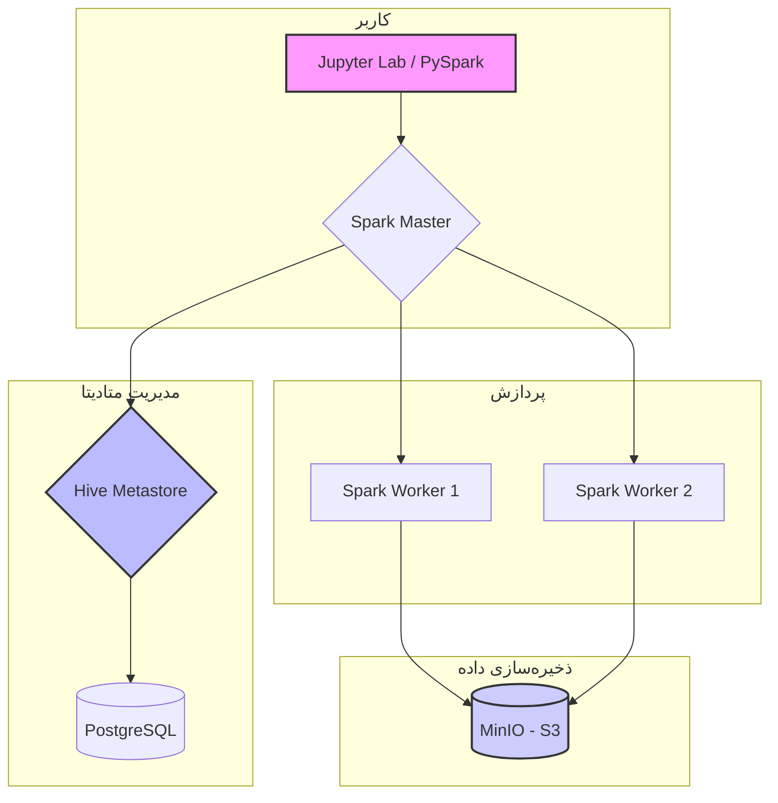

# delta-lake-catalog

## کاتالوگ در Delta Lake چیست؟

کاتالوگ در Delta Lake به عنوان یک مخزن متادیتای مرکزی برای جداول Delta شما عمل می‌کند. به زبان ساده، این یک "فهرست" یا "راهنما" است که تمام اطلاعات مربوط به ساختار و سازماندهی داده‌های شما را در خود جای داده است. این قابلیت به موتورهای پردازشی مانند Apache Spark اجازه می‌دهد تا به طور کارآمد داده‌ها را پیدا کرده، بخوانند و پردازش کنند.

### وظایف اصلی کاتالوگ:

1.  **مدیریت متادیتا (Metadata Management):**
    *   **اسکیما (Schema):** ساختار جدول، نام ستون‌ها و نوع داده‌ی هر ستون را تعریف و نگهداری می‌کند.
    *   **پارتیشن‌بندی (Partitioning):** اطلاعات مربوط به نحوه پارتیشن‌بندی داده‌ها را ذخیره می‌کند تا کوئری‌ها بتوانند فقط پارتیشن‌های مورد نیاز را اسکن کنند و سرعت پردازش افزایش یابد.
    *   **مکان فیزیکی داده‌ها:** آدرس فایل‌های داده (معمولاً فایل‌های Parquet) که هر جدول را تشکیل می‌دهند، در کاتالوگ ثبت می‌شود.

2.  **گزارش تراکنش‌ها (Transaction Log):**
    *   هر تغییری که روی یک جدول Delta اعمال می‌شود (مانند `INSERT`, `UPDATE`, `DELETE`, `MERGE`) به عنوان یک "کامیت" در گزارش تراکنش‌ها (Transaction Log) ثبت می‌شود. این گزارش که به آن `_delta_log` نیز گفته می‌شود، قلب تپنده Delta Lake است.
    *   این گزارش به صورت یک سری فایل JSON ذخیره می‌شود و تضمین‌کننده ویژگی‌های **ACID** (Atomicity, Consistency, Isolation, Durability) برای جداول شماست.

3.  **سفر در زمان (Time Travel):**
    *   از آنجایی که تمام نسخه‌های متادیتا در گزارش تراکنش‌ها حفظ می‌شود، Delta Lake به شما این امکان را می‌دهد که به نسخه‌های قدیمی‌تر داده‌های خود دسترسی داشته باشید. این قابلیت که به آن "Time Travel" یا "Data Versioning" می‌گویند، برای موارد زیر بسیار مفید است:
        *   اشکال‌زدایی (Debugging) خطاها.
        *   بازگرداندن تغییرات ناخواسته.
        *   اجرای مجدد گزارش‌ها بر روی داده‌های یک تاریخ مشخص.

4.  **بهینه‌سازی کوئری (Query Optimization):**
    *   کاتالوگ آمارهای مربوط به داده‌ها (مانند مقادیر حداقل و حداکثر برای هر ستون) را جمع‌آوری و ذخیره می‌کند.
    *   موتورهای کوئری از این آمارها برای بهینه‌سازی پلن اجرای کوئری استفاده می‌کنند. برای مثال، اگر یک کوئری شرطی روی یک ستون داشته باشد که خارج از محدوده آماری یک فایل داده است، آن فایل به طور کامل از اسکن حذف می‌شود (Data Skipping).

### انواع کاتالوگ:

معمولاً دو نوع کاتالوگ در اکوسیستم Spark و Delta Lake استفاده می‌شود:

*   **کاتالوگ مبتنی بر فایل (File-based Catalog):** در این حالت، متادیتا مستقیماً در کنار داده‌ها در یک سیستم فایل (مانند HDFS یا S3) ذخیره می‌شود. این روش ساده است اما برای مدیریت متمرکز در محیط‌های بزرگ مناسب نیست.
*   **کاتالوگ خارجی (External Catalog):** مانند **Hive Metastore** یا **AWS Glue Data Catalog**. این کاتالوگ‌ها به عنوان یک سرویس متمرکز عمل می‌کنند و به چندین کلاستر و کاربر اجازه می‌دهند تا به طور همزمان به یک مجموعه از جداول دسترسی داشته باشند و متادیتای آن‌ها را به اشتراک بگذارند.

به طور خلاصه، کاتالوگ ستون فقرات مدیریت داده در Delta Lake است که ویژگی‌های قدرتمندی مانند تراکنش‌های ACID، سفر در زمان و عملکرد بالا را امکان‌پذیر می‌سازد.

### مثال کاربردی: سیستم فروش آنلاین

فرض کنید یک سیستم فروش آنلاین دارید که داده‌های مربوط به سفارشات (Orders) را در یک جدول Delta ذخیره می‌کنید. این جدول بر اساس ستون `order_date` پارتیشن‌بندی شده است.

1.  **ثبت سفارش جدید (`INSERT`):**
    *   وقتی یک مشتری سفارش جدیدی ثبت می‌کند، یک رکورد جدید به جدول `Orders` اضافه می‌شود.
    *   کاتالوگ متوجه این تغییر می‌شود و یک ورودی جدید در گزارش تراکنش‌ها (`_delta_log`) ایجاد می‌کند. این ورودی شامل اطلاعاتی مانند شناسه کامیت، زمان وقوع تراکنش و فایل داده جدیدی است که به پارتیشن مربوط به تاریخ امروز اضافه شده است.

2.  **لغو سفارش (`UPDATE`):**
    *   اگر مشتری سفارش خود را لغو کند، وضعیت سفارش در جدول `Orders` از "ثبت شده" به "لغو شده" تغییر می‌کند.
    *   Delta Lake به جای بازنویسی فایل داده قدیمی، یک فایل جدید با رکوردهای به‌روز شده ایجاد می‌کند و فایل قدیمی را برای "حذف منطقی" علامت‌گذاری می‌کند.
    *   کاتالوگ این عملیات `UPDATE` را نیز در گزارش تراکنش‌ها ثبت می‌کند و مشخص می‌کند که کدام فایل داده جدید جایگزین کدام فایل قدیمی شده است.

3.  **گزارش‌گیری ماهانه:**
    *   فرض کنید می‌خواهید گزارشی از تمام سفارشات ماه گذشته تهیه کنید. شما یک کوئری `SELECT` با شرط `WHERE order_date BETWEEN '2023-06-01' AND '2023-06-30'` اجرا می‌کنید.
    *   موتور Spark ابتدا به سراغ کاتالوگ می‌رود.
    *   کاتالوگ با استفاده از اطلاعات پارتیشن‌بندی، به سرعت تشخیص می‌دهد که فقط باید به سراغ پارتیشن‌های مربوط به ماه ژوئن برود و بقیه پارتیشن‌ها را نادیده می‌گیرد.
    *   علاوه بر این، با استفاده از آمارهای ذخیره شده (مانند حداقل و حداکثر تاریخ در هر فایل)، ممکن است حتی برخی از فایل‌های داخل پارتیشن‌های ماه ژوئن را نیز از اسکن حذف کند (Data Skipping).
    *   در نهایت، کاتالوگ آخرین نسخه معتبر فایل‌های داده را برای پردازش به Spark تحویل می‌دهد.

4.  **بازگرداندن یک حذف اشتباه (Time Travel):**
    *   تصور کنید یک کارمند به اشتباه تمام سفارشات یک روز خاص را حذف می‌کند.
    *   با استفاده از قابلیت Time Travel و گزارش تراکنش‌ها، شما می‌توانید به سادگی به نسخه‌ی جدول قبل از این حذف اشتباهی بازگردید. کاتالوگ به شما اجازه می‌دهد تا با یک کوئری ساده، وضعیت جدول را به یک زمان یا نسخه خاص برگردانید و داده‌های از دست رفته را بازیابی کنید.

در این سناریو، کاتالوگ مانند یک دفتر ثبت وقایع هوشمند عمل می‌کند که نه تنها تمام تغییرات را با دقت ثبت می‌کند، بلکه به سیستم کمک می‌کند تا داده‌ها را به بهینه‌ترین شکل ممکن پیدا و پردازش کند و از یکپارچگی آن‌ها محافظت نماید.

## پیاده‌سازی Delta Lake با Hive Metastore

این پروژه با هدف راه‌اندازی یک محیط کامل Delta Lake با استفاده از Apache Spark و یک کاتالوگ خارجی Hive Metastore انجام می‌شود. استفاده از Hive Metastore به ما اجازه می‌دهد تا متادیتای جداول Delta را به صورت متمرکز مدیریت کنیم و چندین جلسه (Session) یا برنامه (Application) مختلف بتوانند به این جداول دسترسی داشته باشند.

### معماری سیستم:



### نقشه راه پروژه:

1.  **راه‌اندازی محیط با Docker Compose:**
    *   ایجاد یک فایل `docker-compose.yml` برای تعریف و مدیریت سرویس‌های مورد نیاز.
    *   **سرویس Spark:** شامل یک Master و یک یا چند Worker برای پردازش داده‌ها.
    *   **سرویس Hive Metastore:** برای ذخیره و مدیریت متادیتای جداول.
    *   **سرویس PostgreSQL:** به عنوان پایگاه داده پشتیبان برای Hive Metastore.
    *   **سرویس MinIO:** به عنوان یک ذخیره‌ساز آبجکت (Object Storage) سازگار با S3 برای نگهداری فایل‌های داده Delta Lake.

2.  **پیکربندی Spark برای اتصال به Hive Metastore:**
    *   قرار دادن فایل `hive-site.xml` در مسیر مناسب برای کانتینرهای Spark.
    *   تنظیم متغیرهای پیکربندی Spark (مانند `spark.sql.catalogImplementation` و `spark.hadoop.hive.metastore.uris`) برای فعال‌سازی پشتیبانی از Hive.

3.  **پیکربندی اتصال به MinIO:**
    *   تنظیم کلیدهای دسترسی (Access Key و Secret Key) برای اتصال Spark به MinIO.
    *   پیکربندی Spark برای استفاده از پروتکل S3A برای خواندن و نوشتن داده‌ها.

4.  **اجرای یک مثال کاربردی:**
    *   نوشتن یک اسکریپت پایتون (PySpark) برای انجام عملیات زیر:
        *   ایجاد یک Spark Session با تمام پیکربندی‌های لازم.
        *   ایجاد یک دیتابیس و یک جدول Delta در MinIO که متادیتای آن در Hive Metastore ثبت می‌شود.
        *   انجام عملیات مختلف مانند `INSERT`, `UPDATE`, `DELETE` و `MERGE` روی جدول.
        *   اجرای کوئری برای خواندن داده‌ها و نمایش نتایج.
        *   نمایش قابلیت Time Travel با دسترسی به نسخه‌های قدیمی‌تر جدول.

### نحوه اجرای اسکریپت‌های Spark

از آنجایی که محیط تعاملی (Interactive) مانند JupyterLab به دلیل محدودیت‌های پروکسی در برخی محیط‌ها با مشکل مواجه می‌شود، روش اصلی برای اجرای کد در این پروژه، استفاده از `spark-submit` است. این روش پایدارتر و به محیط‌های پروداکشن نزدیک‌تر است.

1.  **اسکریپت خود را بنویسید:**
    *   کد PySpark خود را در یک فایل پایتون (مثلاً `my_script.py`) در پوشه `work` قرار دهید.

2.  **اسکریپت را اجرا کنید:**
    *   از دستور زیر برای اجرای اسکریپت خود استفاده کنید. فلگ `-T` برای جلوگیری از خطای `the input device is not a TTY` ضروری است:

    ```bash
    docker-compose exec -T spark-master spark-submit /app/work/your_script_name.py
    ```

    *   برای مثال، برای اجرای اسکریپت `test_spark.py` که در پروژه وجود دارد، دستور زیر را اجرا کنید:

    ```bash
    docker-compose exec -T spark-master spark-submit /app/work/test_spark.py
    ```

3.  **مشاهده خروجی:**
    *   خروجی اسکریپت شما (شامل `print` ها و `show` های DataFrame) مستقیماً در ترمینال نمایش داده می‌شود.

### Pipeline ETL: Az Elasticsearch be Delta Lake

در این بخش، یک خط لوله (Pipeline) کامل برای استخراج (Extract) داده‌ها از ایندکس `person_sabt` در Elasticsearch، تبدیل (Transform) آن‌ها در Spark و در نهایت بارگذاری (Load) آن‌ها به عنوان یک جدول Delta در MinIO را پیاده‌سازی می‌کنیم. متادیتای این جدول نیز در Hive Metastore ثبت خواهد شد.

```mermaid
flowchart TD
    A[Elasticsearch<br>(Index: person_sabt)] --> B{Spark Job: etl_elastic_to_delta.py};
    B -- 1. Extract --> C[DataFrame];
    C -- 2. Transform --> D[Transformed DataFrame];
    D -- 3. Load --> E[Delta Lake<br>(Storage: MinIO)];
    B -.-> F{Hive Metastore<br>(Catalog)};
    E -.-> F;

    subgraph "Source"
        A
    end

    subgraph "Processing"
        B
        C
        D
    end

    subgraph "Destination"
        E
        F
    end

    style A fill:#3a3,stroke:#333,stroke-width:2px
    style E fill:#ccf,stroke:#333,stroke-width:2px
    style F fill:#bbf,stroke:#333,stroke-width:2px
```

#### مراحل انجام کار:

1.  **به‌روزرسانی پیکربندی Spark:**
    *   باید پکیج `elasticsearch-spark-connector` را به لیست پکیج‌های Spark اضافه کنیم. این کار از طریق به‌روزرسانی فایل `conf/spark-defaults.conf` انجام می‌شود.

2.  **ایجاد اسکریپت ETL:**
    *   یک اسکریپت پایتون جدید (مثلاً `etl_elastic_to_delta.py`) در پوشه `work` ایجاد می‌کنیم.
    *   **Extract:** در این اسکریپت، با استفاده از کانکتور مخصوص، به Elasticsearch متصل شده و تمام داده‌های ایندکس `person_sabt` را در یک DataFrame بارگذاری می‌کنیم.
    *   **Transform:** در این مرحله می‌توانیم داده‌ها را پاکسازی، تغییر ساختار یا غنی‌سازی کنیم. (در مثال ما، این مرحله ساده خواهد بود).
    *   **Load:** در نهایت، DataFrame تبدیل شده را با فرمت `delta` در مسیر `s3a://my-bucket/person_sabt` در MinIO ذخیره کرده و با استفاده از `saveAsTable`، آن را در کاتالوگ Hive با نام `my_delta_db.person_sabt` ثبت می‌کنیم.

3.  **اجرای اسکریپت ETL:**
    *   با استفاده از دستور `docker-compose exec`، اسکریپت ETL را اجرا می‌کنیم.

4.  **بررسی نتیجه:**
    *   پس از اجرای موفقیت‌آمیز، بررسی می‌کنیم که آیا فایل‌های Parquet مربوط به جدول Delta در MinIO ایجاد شده‌اند و آیا جدول `person_sabt` در Hive Metastore قابل مشاهده است یا خیر.

#### نقش کاتالوگ در Pipeline

ممکن است این سوال پیش بیاید که کاتالوگ دقیقاً در کجای این فرآیند نقش دارد. پاسخ در متد `.saveAsTable()` است:

```python
transformed_df.write.format("delta").mode("overwrite").option("path", delta_path).saveAsTable(full_table_name)
```

این دستور دو کار کلیدی را همزمان انجام می‌دهد:

1.  **ذخیره‌سازی فیزیکی داده:** داده‌های DataFrame را با فرمت `delta` در مسیر مشخص شده در MinIO (`s3a://my-bucket/person_sabt`) ذخیره می‌کند.
2.  **ثبت متادیتا در کاتالوگ:** یک ورودی جدید در **Hive Metastore** ایجاد می‌کند. این ورودی شامل اطلاعات زیر است:
    *   **نام جدول:** `my_delta_db.person_sabt`
    *   **مکان (Location):** `s3a://my-bucket/person_sabt`
    *   **فرمت:** `delta`
    *   **اسکیما:** ساختار و نوع داده‌های ستون‌ها.

**مزیت اصلی این کار چیست؟**

پس از ثبت جدول در کاتالوگ، هر برنامه یا کاربر دیگری می‌تواند به سادگی و تنها با دانستن **نام جدول** به آن دسترسی پیدا کند، بدون اینکه نیازی به دانستن آدرس فیزیکی دقیق آن در MinIO داشته باشد:

```python
# خواندن جدول از طریق کاتالوگ
df = spark.read.table("my_delta_db.person_sabt")
```

این قابلیت، مدیریت داده‌ها را در یک محیط تیمی و در مقیاس بزرگ بسیار ساده‌تر و کارآمدتر می‌کند.
