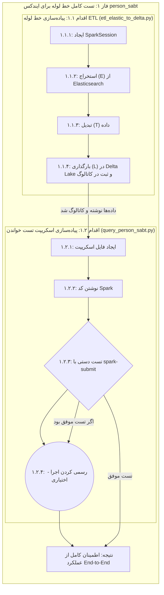

# نقشه راه پروژه: ETL از Elasticsearch به Delta Lake

## چشم‌انداز (Vision)

هدف اصلی این پروژه، ایجاد یک خط لوله (Pipeline) داده کارآمد و مقیاس‌پذیر برای انتقال داده‌ها از چندین ایندکس بزرگ در Elasticsearch به یک Data Lake مدرن مبتنی بر Delta Lake است. پس از انتقال، داده‌ها باید از طریق یک کاتالوگ متمرکز (Hive Metastore) قابل کشف و جستجو باشند تا بتوان تحلیل‌های پیچیده را روی آن‌ها اجرا کرد.

## معماری فعلی

در حال حاضر، زیرساخت اصلی پروژه با استفاده از Docker Compose راه‌اندازی شده و شامل سرویس‌های زیر است:

*   **Spark:** موتور پردازش داده.
*   **MinIO:** ذخیره‌ساز آبجکت (Object Storage) برای فایل‌های Delta Lake.
*   **Hive Metastore:** کاتالوگ متمرکز برای مدیریت متادیتای جداول.
*   **PostgreSQL:** پایگاه داده پشتیبان برای Hive Metastore.
*   **Elasticsearch:** منبع داده اولیه که شامل ایندکس‌های ما است.
*   **Kibana:** ابزار مشاهده و تحلیل داده‌های Elasticsearch.

## نقشه راه بازبینی شده (Revised Roadmap)

با توجه به پیچیدگی‌های احتمالی، نقشه راه پروژه را با رویکرد "اثبات کارکرد سپس تعمیم" (Prove then Generalize) بازبینی می‌کنیم. این رویکرد به ما کمک می‌کند تا ابتدا از صحت عملکرد کامل خط لوله برای یک نمونه مطمئن شویم و سپس آن را برای موارد بیشتر گسترش دهیم.

### فاز ۱: پیاده‌سازی و تست کامل خط لوله برای یک ایندکس (End-to-End Test for a Single Index)

در این فاز، تمام مراحل را فقط برای ایندکس `person_sabt` انجام می‌دهیم تا از کارکرد صحیح تمام اجزا مطمئن شویم.



*   **اقدام ۱.۱: پیاده‌سازی خط لوله ETL (موجود در `etl_elastic_to_delta.py`)**
    *   **۱.۱.۱: ایجاد SparkSession:** ساخت یک `SparkSession` با تمام تنظیمات لازم برای اتصال به Hive Metastore، MinIO (S3) و Elasticsearch.
    *   **۱.۱.۲: استخراج (Extract):** خواندن داده‌ها از ایندکس `person_sabt` در Elasticsearch و تبدیل آن‌ها به یک Spark DataFrame.
    *   **۱.۱.۳: تبدیل (Transform):** انجام تغییرات لازم روی DataFrame (در این مثال، این مرحله ساده است).
    *   **۱.۱.۴: بارگذاری (Load):** ذخیره DataFrame نهایی با فرمت `delta` در MinIO و ثبت متادیتای آن (نام، مکان و اسکیما) در Hive Metastore با استفاده از `.saveAsTable()`.

*   **اقدام ۱.۲: پیاده‌سازی اسکریپت تست خواندن از کاتالوگ**
    *   **۱.۲.۱: ایجاد فایل اسکریپت:** ایجاد یک فایل خالی به نام `work/query_person_sabt.py`.
    *   **۱.۲.۲: نوشتن کد Spark:** پیاده‌سازی کد PySpark برای خواندن مستقیم از جدول `my_delta_db.person_sabt` با استفاده از `spark.read.table()`، اعمال یک فیلتر ساده و نمایش نتیجه.
    *   **۱.2.3: تست دستی اسکریپت:** اجرای اسکریپت با استفاده از `spark-submit` در کانتینر `spark-master` برای اطمینان از صحت عملکرد کد قبل از تغییر `docker-compose.yml`.
        ```bash
        docker-compose exec -T spark-master spark-submit /app/work/query_person_sabt.py
        ```
    *   **۱.۲.۴ (اختیاری): رسمی کردن اجرا:** پس از تست موفق، اضافه کردن یک سرویس `query-job` به `docker-compose.yml` برای اجرای استاندارد اسکریپت.

*   **نتیجه فاز ۱:** اطمینان کامل از اینکه داده‌ها به درستی در Delta Lake ذخیره، در Hive Metastore کاتالوگ و از طریق کاتالوگ قابل بازیابی و جستجو هستند.

### فاز ۲: پارامتریزه کردن و تعمیم اسکریپت‌ها

پس از اطمینان از عملکرد صحیح خط لوله، اسکریپت‌ها را برای استفاده عمومی آماده می‌کنیم.

*   **اقدام:** اسکریپت‌های `etl_elastic_to_delta.py` و `query_person_sabt.py` را طوری تغییر می‌دهیم که نام ایندکس و جدول را به عنوان آرگومان ورودی دریافت کنند.
*   **نتیجه:** دو اسکریپت قدرتمند و قابل استفاده مجدد برای ETL و جستجوی هر نوع داده‌ای.

### فاز ۳: ایجاد یک اسکریپت ارکستراسیون (Orchestration)

در این فاز، فرآیند اجرای خط لوله برای چندین ایندکس را خودکار می‌کنیم.

*   **اقدام:** یک اسکریپت Shell (مثلاً `run_etl_for_all.sh`) ایجاد می‌کنیم که لیستی از ایندکس‌ها را خوانده و اسکریپت ETL پارامتریزه شده را برای هر کدام اجرا می‌کند.
*   **نتیجه:** قابلیت اجرای کل فرآیند مهاجرت داده‌ها برای تمام ایندکس‌ها تنها با یک دستور.

---

این نقشه راه جدید، ریسک پروژه را کاهش داده و به ما اجازه می‌دهد تا به صورت گام به گام و با اطمینان بیشتری به سمت هدف نهایی حرکت کنیم.
